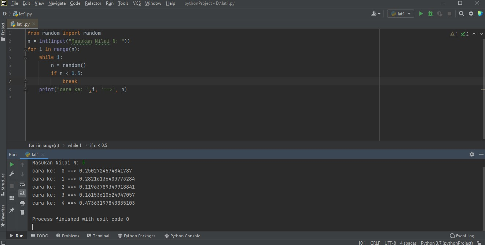
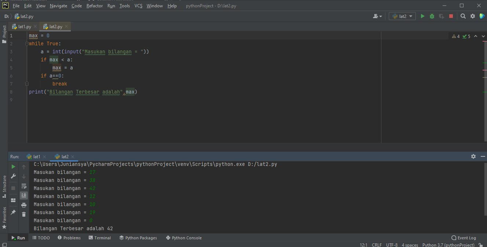
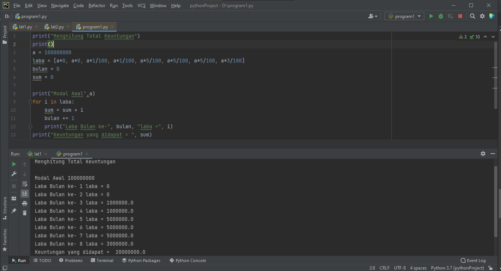

# labspy03

## Latihan1

1. Tampilkan n jumlah bilangan acak yang lebih kecil dari 0.5
2. Nilai n diisi pada saat runtime
3. Kalian bisa menggunakan kominasi while dan for untuk menyelesaikannya
4. Gunakan fungsi random() yang dapat diimport terlebih dahulu

#### Program dan Output



- Langkah-langkah
1. Masukan fungsi random terlebih dahulu
2. Deklarasi interger
3. Masukan deskripsi kombinasi "for" untuk menyelesaikannya
4. Masukan nilai jumlah (N) : 0.5
5. Mencetak data ke-1 sampai ke-5 hasil nilai kurang dari 0.5


```bash 
from random import random
n = int(input("Masukan Nilai N: "))
for i in range(n):
    while 1:
        n = random()
        if n < 0.5:
            break
    print("cara ke: ",i, '==>', n)
```

## Latihan2

Membuat program untuk menampilkan bilangan terbesar dari n buat data yang diinput, 
kemudian masukaan angka 0 untuk berhenti.


### Program dan Output



- Langkah-langkah

1. Mencetak "menampilkan bilangan, berhenti ketika bilangan 0, menampilkan bilangan terbesar"
2. bilangan bulat maks = 0
3. Menggunakan fungsi perulangan "while true"
4. Memasukan bilangan integer pada "a"
5. Menggunakan fungsi if jika max kurang dari nilai a dan max = a
6. Mengunakan fungsi break bertanda perulangan akan berhenti jika menulis nilai 0.
7. Mencetak nilai paling besar.

```bash
max = 0
while True:
    a = int(input("Masukan bilangan = "))
    if max < a:
        max = a
    if a==0:
        break
print("Bilangan Terbesar adalah",max)
```

## Program 1

Membuat program sederhana dengan perulangan: 

Seorang pengusaha menginvestasikan uangnya untuk memulai usahanya dengan modal awal 100 juta,
- Pada bulan pertama dan kedua belum mendapatkan laba
- Pada bulan ketiga mulai mendapatkan laba sebesar 1%
- Pada bulan kelima pendapatan meningkat laba sebesar 5%
- Pada bulan kedepalan mengalami penurunan keuntungan sebesar 2%, sehingga laba menjadi 3%
Hitunglah total keuntungan selama 8 bulan berjalan usahanya!


### Program dan Output



- Langkah-langkah

1. Mencetak "Program menghitung laba dengan modal awal 100 juta"
2. integer a = 100.000.000( modal awal)
3. Dari variabel laba terdapat rincian modal dari bulan pertama hingga akhir
4. Untuk melakukan perulangan variabel "i" kedalam variabel laba. agar variabel i mendapat akses rincian yang ada didalam variabel laba
    " for i in laba: "
5. Menambahkan variabel "sum" dengan variabel "i" agar mengulang hingga program selesai
    " sum = sum + 1"
6. Menambahkan variabel bulan yang dimulai dari bulan 1 hingga program selesai
    " bulan =+1 "
7. Menampilkan laba dari bulan pertamma sampai akhir
    ("Laba Bulan ke-", bulan, "laba =", i)
8. Menampilkan keuntungan yang didapat selama 8 bulan


```bash
print("Menghitung Total Keuntungan")
print()
a = 100000000
laba = [a*0, a*0, a*1/100, a*1/100, a*5/100, a*5/100, a*5/100, a*3/100]
bulan = 0
sum = 0

print("Modal Awal",a)
for i in laba:
    sum = sum + i
    bulan += 1
    print("Laba Bulan ke-", bulan, "laba =", i)
print("Keuntungan yang didapat = ", sum)
```

## Terima kasih